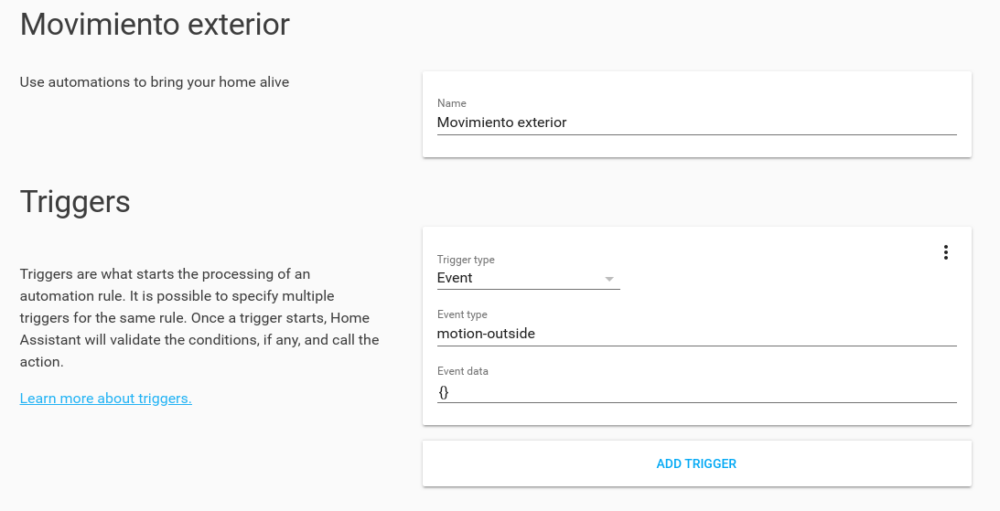

.. highlight:: console

.. _configure_file:

===========
Config file
===========

The configuration file can be found anywhere but if the program runs in root mode,
it is necessary that only root can modify the file. This is a security measure to prevent
someone from executing commands as root using Amazon-dash.

To change the permissions::

    sudo chmod 600 amazon-dash.yml
    sudo chown root:root amazon-dash.yml

The amazon-dash system configuration file is located in: ``/etc/amazon-dash.yml``

You can disable this security measure using ``--ignore-perms``. Use this option at your own risk only in secure
environments (like Docker).

.. important::
    Remember to restart the service whenever you make a change to apply it.
    If you are using systemd, restart the service using ``systemctl restart amazon-dash``

Example
-------
The following example is available in ``/etc/amazon-dash.yml`` when installed:

.. literalinclude:: ../amazon_dash/install/amazon-dash.yml

Real example:

.. code-block:: yaml

    # amazon-dash.yml
    # ---------------
    settings:
      delay: 10
      interface:
        - wlan0
        - eth0
    devices:
      0C:47:C9:98:4A:12:
        name: Hero
        user: nekmo
        cmd: spotify
      AC:63:BE:75:1B:6F:
        name: Tassimo
        cmd: door --open
        ssh: 192.168.1.23:2222
      AC:63:BE:67:B2:F1:
        name: Kit Kat
        url: 'http://domain.com/path/to/webhook'
        method: post
        content-type: json
        body: '{"mac": "AC:63:BE:67:B2:F1", "action": "toggleLight"}'
        confirmation: send-tg
      40:B4:CD:67:A2:E1:
        name: Fairy
        homeassistant: hassio.local
        event: toggle_kitchen_light
      18:74:2E:87:01:F2:
        name: Doritos
        openhab: 192.168.1.140
        item: open_door
        state: "ON"
        confirmation: send-pb
      44:65:0D:75:A7:B2:
        name: Pompadour
        ifttt: cdxxx-_gEJ3wdU04yyyzzz
        event: pompadour_button
        data: {"value1": "Pompadour button"}
    confirmations:
      send-tg:
        service: telegram
        token: '402642618:QwGDgiKE3LqdkNAtBkq0UEeBoDdpZYw8b4h'
        to: 24291592
        is_default: false
      send-pb:
        service: pushbullet
        token: 'o.BbbPYjJizbPr2gSWgXGmqNTt6T9Rew51'
        is_default: false

Common options
--------------
The syntax of the configuration file is yaml. The configuration file has 3 main sections:

* **settings** (optional): common options.
* **devices** (required): The amazon dash devices.
* **confirmations** (optional): confirmation on device executed.

settings section
~~~~~~~~~~~~~~~~
The following options are available in **settings**:

* **delay** (optional): On seconds. By default, 10 seconds. Minimum time that must pass between pulsations of the
  Amazon Dash button.
* **interface**: (optional): an array, a string, or null. Allows listening on a specific interface or
  multiple interfaces.

Device section
~~~~~~~~~~~~~~
Each **device** is identified by the button **mac**. The mac can be obtained with the discovery command.
In the configuration of each button, there may be a way of execution. Only one execution method is allowed
for each device. The available exection methods are:

* **cmd**: local command line command. Arguments can be placed after the command.
* **url**: Call a url.
* **homeassistant**: send event to Home Assistant. This argument must be the address to the hass server (protocol and
  port are optional. By default http and 8123, respectively).
* **openhab**: send event to OpenHAB. This argument must be the address to the hass server (protocol and
  port are optional. By default http and 8080, respectively).

The devices can also have **these common options**:

* **name**: device name for log messages.
* **confirmation**: confirmation to use on device execution.

A device example:

.. code-block:: yaml

    # amazon-dash.yml
    # ---------------
    settings:
      delay: 10
    devices:
      0C:47:C9:98:4A:12:
        name: Hero
        user: nekmo
        cmd: spotify

Confirmation section
~~~~~~~~~~~~~~~~~~~~
Send a **confirmation after running a device**. Send a message whether the execution is successful or if it fails. If
the execution returns an output this will be the message that is sent.

Each confirmation has **a name** to be able to use it on the devices (on the example ``confirmation-name``):

.. code-block:: yaml

    # amazon-dash.yml
    # ---------------
    settings:
      delay: 10
    devices:
      AC:63:BE:67:B2:F1:
        name: Kit Kat
        url: 'http://domain.com/path/to/webhook'
        confirmation: confirmation-name
    confirmations:
      confirmation-name:
        service: telegram
        token: '402642618:QwGDgiKE3LqdkNAtBkq0UEeBoDdpZYw8b4h'
        to: 24291592

For run a confirmation for all devices by default using ``is_default: true``:

.. code-block:: yaml

    # amazon-dash.yml
    # ---------------
    settings:
      delay: 10
    devices:
      # ...
    confirmations:
      confirmation-name:
        service: telegram
        token: '402642618:QwGDgiKE3LqdkNAtBkq0UEeBoDdpZYw8b4h'
        to: 24291592
        is_default: true

Execution
---------
The devices section allows you to perform an action when you press an Amazon dash button.
The following execution methods are available.

.. _execute_cmd:

Execute cmd
~~~~~~~~~~~
When the **cmd execution method** is used, the following options are available.

* **user**: System user that will execute the command. This option can only be used if Amazon-Dash is running as root.
* **cwd**: Directory in which the command will be executed.
* **ssh**: Optional. It allows executing the command on a remote machine.

Example:

.. code-block:: yaml

    # amazon-dash.yml
    # ---------------
    settings:
      delay: 10
    devices:
      0C:47:C9:98:4A:12:
        name: Hero
        user: nekmo
        cmd: spotify

It is also possible to execute a command using SSH. The value of the ssh option must be the name/IP of the machine.
You can also specify the port. For example: ``machine:2222``.

Example:

.. code-block:: yaml

    # amazon-dash.yml
    # ---------------
    settings:
      delay: 10
    devices:
      AC:63:BE:75:1B:6F:
        name: Tassimo
        cmd: door --open
        ssh: 192.168.1.23:2222

Call url
~~~~~~~~
When the **url execution method** is used, the following options are available.

* **method**: HTTP method. By default GET.
* **headers**: Headers to send to server. Content-Type will be overwritten if it is defined later.
* **content-type** (*): HTTP Content-Type Header. Only available if Body is defined. If body is defined, default is form.
* **body**: Request payload. Only if the method is POST/PUT/PATCH. In json or form mode, the content must be a valid json. It is recommended to use single quotes before and after content in json.
* **verify**: By default True. Validate SSL/TLS certificate on request. To ignore errors (for example self-signed
  certificate) put false. You can also set the path to the certificate or certificate directory (generate using
  OpenSSL ``c_rehash`` utility).

(*) Content type aliases: ``form = application/x-www-form-urlencoded``. ``json = application/json``.
``plain =text/plain``.

Example:

.. code-block:: yaml

    # amazon-dash.yml
    # ---------------
    settings:
      delay: 10
    devices:
      AC:63:BE:67:B2:F1:
        name: Kit Kat
        url: 'http://domain.com/path/to/webhook'
        method: post
        content-type: json
        body: '{"mac": "AC:63:BE:67:B2:F1", "action": "toggleLight"}'
        confirmation: send-tg

.. _homeassistant:

Home Assistant event
~~~~~~~~~~~~~~~~~~~~
When the **homeassistant execution method** is used, the following options are available.

* **event** (required): Event name to send.
* **data**: Event data to send. Use json as string.
* **access_token**: Long-lived Home Assistant access token.
* **access**: Home Assistant legacy API password (``x-ha-access`` header).
* **verify**: By default True. Validate SSL/TLS certificate on request. To ignore errors (for example self-signed
  certificate) put false. You can also set the path to the certificate or certificate directory (generate using
  OpenSSL ``c_rehash`` utility). This can be useful if you use self-signed https.

Starting with version 0.78 of Home Assistant, there are two ways Amazon Dash can authenticate:

1. By providing a long-lived access token (generated within your Home Assistant profile page) via
   the ``access_token`` option.
2. By providing the legacy Home Assistant API password via the ``access`` option.

Although both options currently work, the Home Assistant project plans to deprecate (and likely remove) the legacy
API password in the future; therefore, to properly future proof your Amazon Dash setup, the long-lived access
token option is recommended.

The protocol and the port in the address of the Homeassistant server are optional. The syntax of the address is:
``[<protocol>://]<server>[:<port>]. For example: ``https://hassio.local:1234``.

Example:

.. code-block:: yaml

    # amazon-dash.yml
    # ---------------
    settings:
      delay: 10
    devices:
      40:B4:CD:67:A2:E1:
        name: Fairy
        homeassistant: hassio.local
        event: toggle_kitchen_light

To perform the action in Home Assistant you can use any event name to send; for example, ``toggle_kitchen_light``.
Then you must **create an automation** in Home Assistant to perform one or several actions in Home Assistant
when the event is received.

It is possible (but not recommended) to run a service directly using amazon-dash:

.. code-block:: yaml

    # amazon-dash.yml
    # ---------------
    settings:
      delay: 10
    devices:
      40:B4:CD:67:A2:E1:
        name: Fairy
        homeassistant: hassio.local
        event: call_service
        data: '{"domain": "light", "service": "toggle", "service_data": {"entity_id": "light.Main_Room"}}'

Running a service using Amazon-dash is more limited and may break the configuration in the future. For example,
your ``entity_id`` could change in the future if you change your service.

More info in the homeassistant documentation:

* https://www.home-assistant.io/docs/configuration/events/
* https://www.home-assistant.io/docs/automation/trigger/

OpenHAB event
~~~~~~~~~~~~~
When the **openhab execution method** is used, the following options are available.

* **item** (required): Open Hab item to send.
* **state**: State to send. On switch items ON/OFF. ON by default. The state must be between quotes.

The protocol and the port in the address of the OpenHAB server are optional. The syntax of the address is:
``[<protocol>://]<server>[:<port>]. For example: ``https://192.168.1.140:1234``.

Example:

.. code-block:: yaml

    # amazon-dash.yml
    # ---------------
    settings:
      delay: 10
    devices:
      18:74:2E:87:01:F2:
        name: Doritos
        openhab: 192.168.1.140
        item: open_door
        state: "ON"

.. _iftt:

IFTTT event
~~~~~~~~~~~
When the **IFTTT execution method** is used, the following options are available.

* **event** (required): Event name to send. You define the event name when creating a Webhook applet.
* **data**: dictionary with the "ingredients" (variables) for IFTTT.

To use IFTTT:

#. Create the applet by selecting the webhook service: https://ifttt.com/search . You will have to define a
   **event name**.
#. Get your IFTTT Webhook **key**: https://ifttt.com/services/maker_webhooks/settings
#. Put the *event name* and the *key* in the **Amazon-dash configuration**.

Example:

.. code-block:: yaml

    # amazon-dash.yml
    # ---------------
    settings:
      delay: 10
    devices:
      44:65:0D:75:A7:B2:
        name: Pompadour
        ifttt: cdxxx-_gEJ3wdU04yyyzzz
        event: pompadour_button
        data: {"value1": "Pompadour button"}

Confirmations
-------------
The following **services** are supported to send confirmation messages.

Telegram
~~~~~~~~
For use a telegram service you need to define:

* **token**: get your own token for your bot using ``/newbot`` on `@BotFather <https://t.me/botfather>`_.
* **to**: your telegram id. You can get it using `@get_id_bot <https://t.me/get_id_bot>`_ or other method.

After create a bot, you need to start a conversation with your bot. Bots can not send messages to users if people
have not started a conversation before.

.. code-block:: yaml

    # amazon-dash.yml
    # ---------------
    settings:
      delay: 10
    devices:
      # ...
    confirmations:
      send-tg:
        service: telegram
        token: '402642618:QwGDgiKE3LqdkNAtBkq0UEeBoDdpZYw8b4h'
        to: 24291592
        is_default: false

Pushbullet
~~~~~~~~~~
For use a pushbullet service you need to define:

* **token**: Get it in your pushbullet Access Token (create a token): https://www.pushbullet.com/#settings/account

Optional: set a target (you can only set a target):

* **device_iden**: Device identifier. To get your device identifier:
  ``$ curl --header 'Access-Token: <YOUR TOKEN>' https://api.pushbullet.com/v2/devices``
* **email**: Useful to send a message to your contacts.
* **channel_tag**: Send to all subscribers to your channel.
* **client_iden**: Send to all users who have granted access to your OAuth client.

.. code-block:: yaml

    # amazon-dash.yml
    # ---------------
    settings:
      delay: 10
    devices:
      # ...
    confirmations:
      send-pb:
        service: pushbullet
        token: 'o.BbbPYjJizbPr2gSWgXGmqNTt6T9Rew51'
        is_default: false
